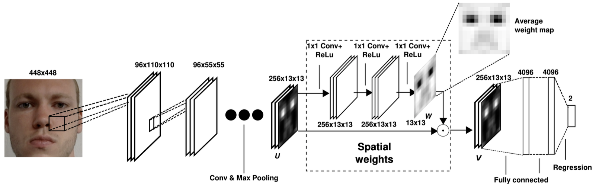
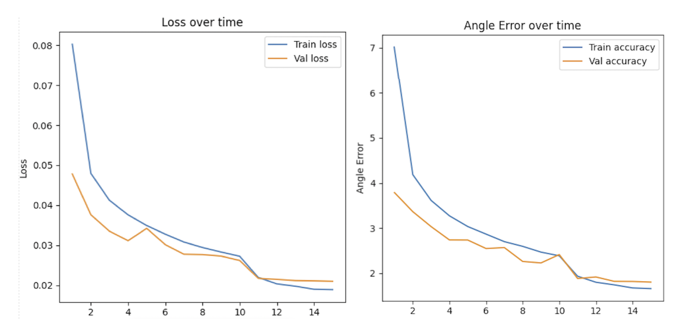
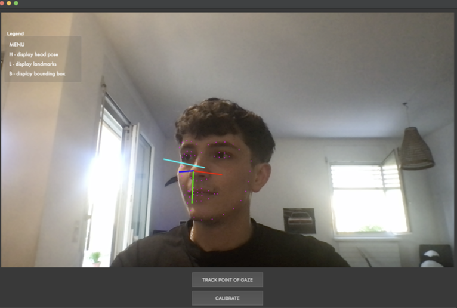
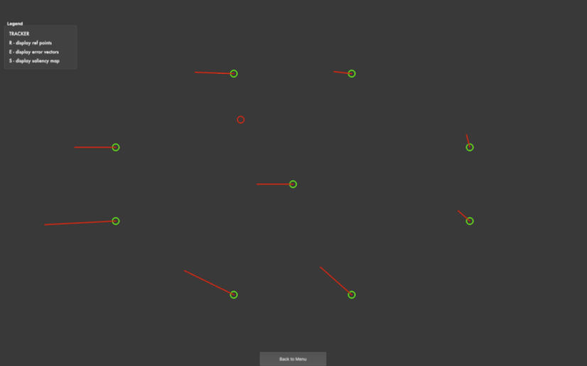
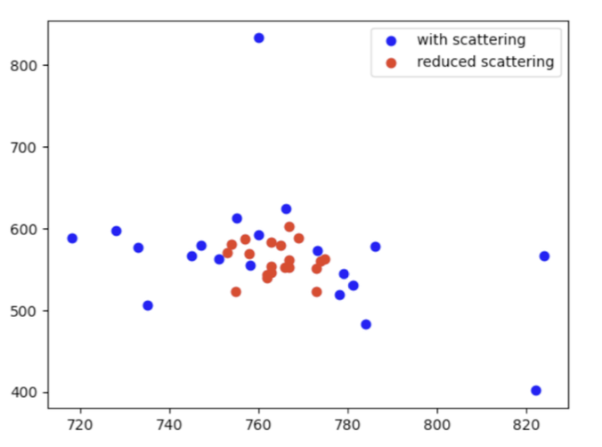

# GazeTracker - Appearence-Based Gaze Estimation


GazeTracker is my appearance-based gaze estimation system developed as part of a bachelor's project at Università della Svizzera italiana, Faculty of Informatics. This system leverages the full potential of Convolutional Neural Networks (CNNs) and spatial weighting mechanisms to provide accurate and real-time gaze tracking capabilities, following the studies showcased in the paper [It’s Written All Over Your Face: Full-Face Appearance-Based Gaze Estimation](https://www.mpi-inf.mpg.de/departments/computer-vision-and-machine-learning/research/gaze-based-human-computer-interaction/its-written-all-over-your-face-full-face-appearance-based-gaze-estimation).

## Features

**Full-Face Gaze Estimation**: Utilizes a CNN model optimized with a spatial weighting mechanism to focus on relevant facial features for gaze estimation.
<p align="center">
  
</p>
<p align="center">
  
</p>
  

**3D Gaze Direction**: Estimates 3D gaze direction from a full-face image, enabling applications in various fields such as marketing research, human-computer interaction, and healthcare.\
**Dataset Utilization**: Employs the MPIIFaceGaze dataset for training, ensuring robustness across diverse lighting conditions, head poses, and gaze directions.\
**GUI for Real-Time Tracking**: A user-friendly graphical interface built with PySide6, showcasing **3D gaze estimation in real-time** or **Point of Gaze** on screen.

<p align="center">
  
</p>

**Improving Accuracy & Usability**: Utilities to easily calibrate the camera and get rid of Radial Distortion. Possibility to reduce per user dependent error by Reference Point Calibration.

<p align="center">
  
</p>

Noise is a common issue in gaze tracking systems. Scattering can significantly affect the accuracy and usability of a gaze tracking system.
To address the issue of scattering, a streaming moving average method was implemented.

<p align="center">
  
</p>

## Usage

**Get the model**: Get a pretrained model of MPIIFaceGaze (can be easily found online), or train your own using the Python NoteBook present in this repository. Model to be saved under data/models

**Install requirements**: 
```bash
pip install -r requirements.txt
```
**Camera Calibration**:
To be used the classic chessboard for OpenCV camera calibration. Square size in centimeters.
```bash
python utils/camera_calibration.py --square_size NN --pattern NxN
```
**Run the GUI**:
```bash
python app.py
```

**User Calibration**:
Once in the Home View click on "Calibration", after entering a name, used to save the calibration id, calibration can be performed following reference point (all commands showcased in the Legend), save.
Once on the "TRACK POINT OF GAZE" feature, enter the calibration name entered during calibration process.


## Future Work

Saliency map to reduce noise

Dockerize the project

## Acknowledgments

Credits to advisor Prof. Piotr Didyk and references to foundational works and datasets that supported the development of GazeTracker.

It’s Written All Over Your Face: Full-Face Appearance-Based Gaze Estimation, X. Zhang, Y. Sugano, M. Fritz and A. Bulling, Proc. of the IEEE Conference on Computer Vision and Pattern Recognition Workshops(CVPRW), 2017.

